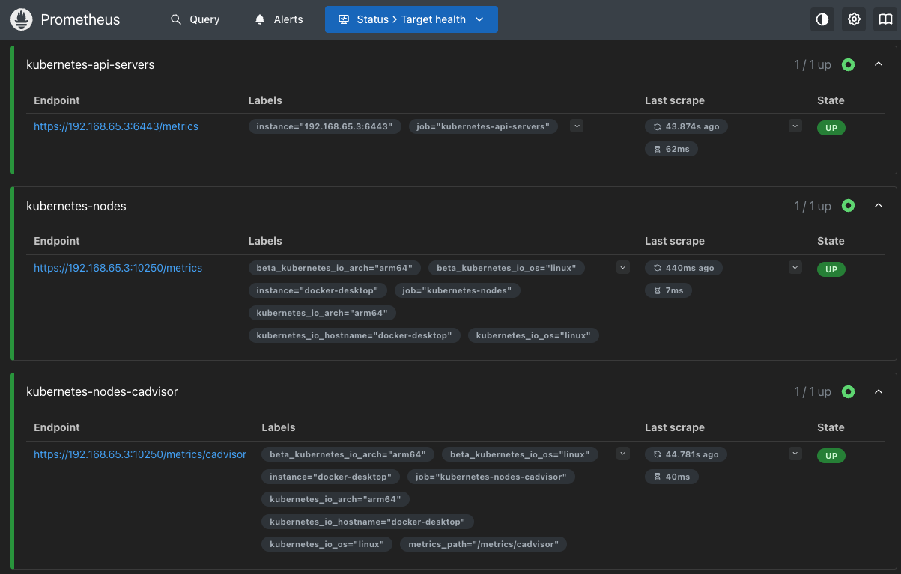
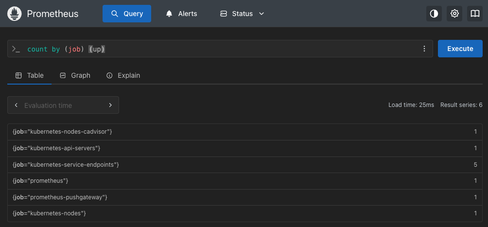

# SRE Observability Platform

Kubernetes observability stack using Prometheus and Grafana.

## Stack
- Kubernetes (docker-desktop)
- Prometheus
- Node Exporter
- Grafana
- Alertmanager

## Features
- Cluster metrics collection
- Node monitoring
- Grafana dashboards
- Prometheus alerting
- Runbooks for incident response

## Architecture diagram

K8s → Prometheus → Grafana

## Prometheus (ocalhost:9090)

