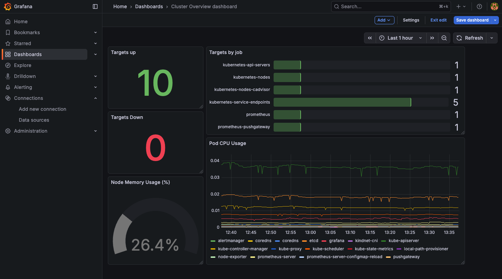

# SRE Observability Platform
Kubernetes-based observability stack to monitor containerized workloads using Prometheus and Grafana.

## Overview
This project demonstrates how to build a complete observability stack for Kubernetes, including:

- Metrics collection
- Visualization dashboards
- Alerting system
- Incident response via runbooks

The goal is to replicate a **real-world SRE monitoring setup** used in production environments.

## Stack
- Kubernetes
- Prometheus
- Node Exporter
- Grafana
- Alertmanager

## Features
- Cluster-wide metrics collection
- Node and container monitoring
- Custom Grafana dashboards
- Prometheus alerting rules
- Runbooks for incident response

## Architecture

```
┌─────────────────────────────────────────────────────┐
│                  Kubernetes Cluster                  │
│                                                     │
│  ┌──────────────┐     ┌────────────────────────┐   │
│  │ Node Exporter│────▶│                        │   │
│  └──────────────┘     │      Prometheus        │──▶│── Alertmanager
│  ┌──────────────┐     │  (metrics scraping &   │   │
│  │  sample-app  │────▶│      alerting)         │   │
│  └──────────────┘     └───────────┬────────────┘   │
│                                   │                 │
└───────────────────────────────────┼─────────────────┘
                                    ▼
                               ┌─────────┐
                               │ Grafana │
                               └─────────┘
```

Prometheus scrapes metrics from Kubernetes components and exporters. Grafana visualizes them through dashboards. Alertmanager handles alert routing and notifications.

## Project Structure

```
.
├── dashboards/
│   └── grafana/
│       └── cluster-overview.json   # Grafana dashboard definition
├── images/                         # README screenshots
├── kubernetes/
│   ├── prometheus/
│   │   ├── values.yaml             # Helm values for Prometheus
│   │   └── prometheus.yml          # Prometheus scrape config
│   └── sample-app/
│       ├── deployment.yaml         # Sample app deployment
│       └── service.yaml            # Sample app service
├── runbooks/
│   └── high-cpu.md                 # Runbook: High CPU alert
└── README.md
```

## Prerequisites

- [Docker Desktop](https://www.docker.com/products/docker-desktop/) with Kubernetes enabled
- [`kubectl`](https://kubernetes.io/docs/tasks/tools/) configured
- [`helm`](https://helm.sh/docs/intro/install/) v3+

## Getting Started

### 1. Set Kubernetes context
```bash
kubectl config use-context docker-desktop
kubectl get nodes
```

### 2. Create namespace
```bash
kubectl create namespace observability
```

### 3. Add Helm repositories
```bash
helm repo add prometheus-community https://prometheus-community.github.io/helm-charts
helm repo add grafana https://grafana.github.io/helm-charts
helm repo update
```

### 4. Install Prometheus
```bash
helm install prometheus prometheus-community/prometheus \
  -n observability \
  -f kubernetes/prometheus/values.yaml
```

Key settings in [`kubernetes/prometheus/values.yaml`](kubernetes/prometheus/values.yaml):
- `server.service.type: ClusterIP` — Prometheus is not exposed externally
- `alertmanager.enabled: true` — Alertmanager is deployed alongside Prometheus
- `pushgateway.enabled: false` — Pushgateway is disabled (not needed for this setup)

### 5. Install Grafana
```bash
helm install grafana grafana/grafana -n observability
```

### 6. Access services
```bash
kubectl port-forward -n observability svc/prometheus-server 9090:80
kubectl port-forward -n observability svc/grafana 3000:80
```

### 7. Log in to Grafana
Default username: `admin`

Retrieve the auto-generated password:
```bash
kubectl get secret --namespace observability grafana \
  -o jsonpath="{.data.admin-password}" | base64 --decode
```

Then open [http://localhost:3000](http://localhost:3000).

### 8. Import the Grafana dashboard
1. In Grafana, go to **Dashboards → Import**
2. Upload [`dashboards/grafana/cluster-overview.json`](dashboards/grafana/cluster-overview.json)

## Runbooks

| Alert | Runbook |
|-------|---------|
| High CPU | [runbooks/high-cpu.md](runbooks/high-cpu.md) |

## Screenshots

### Prometheus UI (localhost:9090)


### Grafana Dashboard (localhost:3000)
Cluster overview dashboard visualizing system health and resource usage:


